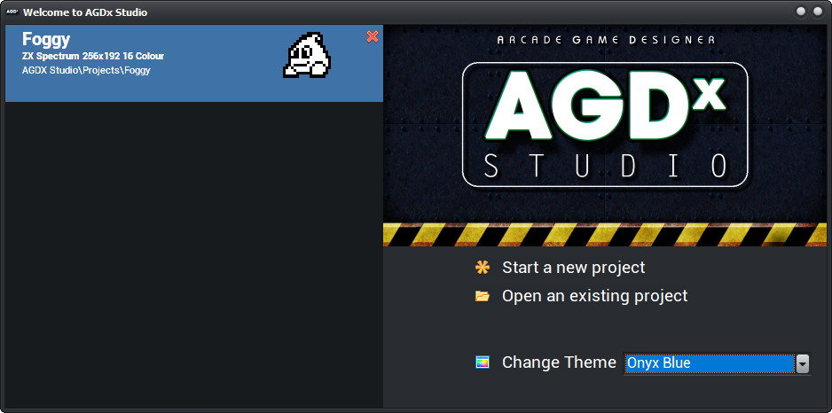
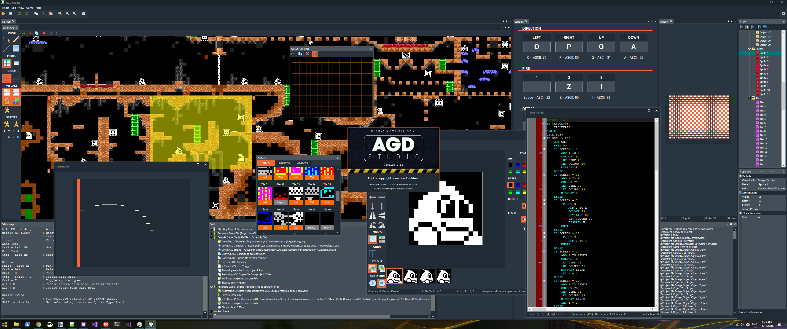

# An IDE for Jonathan Cauldwell's Arcade Game Designer

Editors for:
* Images 
  * Sprites
  * Objects
  * Tiles/Blocks
* Events (Code)
  * Syntax highlighting editor
    * AGD syntax
    * Asm syntax (TBD)
  * Code folding
* Map
* Messages
* Window size and position
* Keys

Automated build system:
* Produces AGD compiler output on the fly
* Automatic compiled output

Themes:
* Multiple user selectable UI themes
* Dockable content editors and helper panel
  * Future improvements:
    * Save layout per project

## Releases
https://github.com/tonyt73/AGD-Studio/releases

## Build Instructions

* Clone this repo on to your PC
* Download and Install the Embarcardero Rad-Studio C++ Community Edition
  * https://www.embarcadero.com/products/cbuilder/starter/free-download
  * Register if you need to (its free)
  * Install the 32 bit and 64 bit Windows compilers (OSX, iOS & Android are optional)
  * I personally use Rad Studio 11.2
* Download the trial version of LMD Innovative components
  * http://files.lmd.de/downloads/
  * Unzip and run the Setup application
  * Click Next to all questions to Install all defaults

* Install the latest release
  * This will install all the configuration files and the example project

* Launch the Rad-Studio IDE
  * Install the DOSCommand component from GetIt Package Manager
   * Setup the paths for DOS Command
   * Tools -> Options -> IDE -> Environment Variables
     * New..
        * Variable: DOSCMD_HDR
        * Value: {location of Dos Command source code}\DOSCommand\Packages\Alexandria\cpp
        * Variable: DOSCMD_LIB
        * Value: $(BDSCOMMONDIR)\Dcp
     * {latest version} = Sydney, Rio, Alexandria etc
   * Tools -> Options -> Language -> Paths and Directories
     * Windows 32-bit
        * System Library Path [...] -> Add $(DOSCMD_LIB)
        * System Include path [...] -> Add $(DOSCMD_HDR)\Win32\Release
     * Windows 64-bit
        * System Library Path [...] -> Add $(DOSCMD_LIB)\Win64\Release
        * System Include path [...] -> Add $(DOSCMD_HDR)\Win64\Release
    * Click Save

  * Open up the location you cloned this repo to
  * Open the AGD Studio.cproj file
* Press F9 to build and run the application

